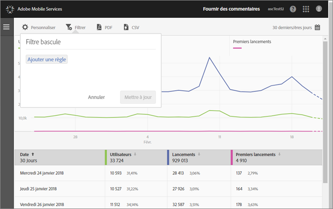
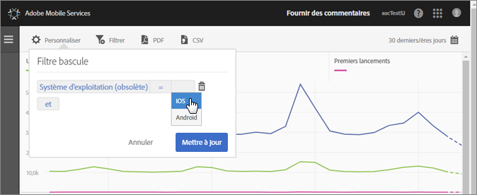

# Ajout d’un filtre bascule {#add-sticky-filter}

Créez un filtre couvrant différents rapports, afin de visualiser le comportement d’un segment par rapport à l’ensemble des rapports mobiles. Un filtre d’attractivité vous permet de définir un filtre qui est appliqué à tous les rapports autres que de cheminement.

L’exemple suivant permet d’ajouter des filtres bascules pour les systèmes d’exploitation iOS et Android dans le rapport **[!UICONTROL Utilisateurs et sessions]**, mais ces instructions peuvent s’appliquer à n’importe quels autres rapports et mesures.

1. Cliquez sur l’icône **[!UICONTROL Filtrer]** en haut d’un rapport dans Adobe Mobile.

   

1. Dans la boîte de dialogue Filtre bascule, cliquez sur **[!UICONTROL Ajouter une règle]**, sélectionnez **[!UICONTROL Systèmes d’exploitation]**, puis sélectionnez **[!UICONTROL iOS]** dans la liste déroulante.

   Pour ajouter Android en tant que filtre, répétez cette étape.

   

1. Cliquez sur **[!UICONTROL Et]**, sélectionnez **[!UICONTROL Systèmes d’exploitation]**, puis choisissez **[!UICONTROL Android]** dans la liste déroulante.

   Vos filtres doivent dès lors ressembler à l’exemple suivant :

   

1. Cliquez sur **[!UICONTROL Mettre à jour]** et **[!UICONTROL Exécuter]**.
