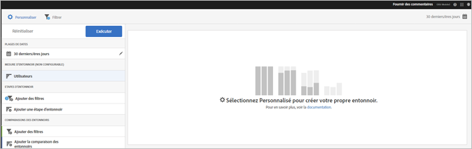
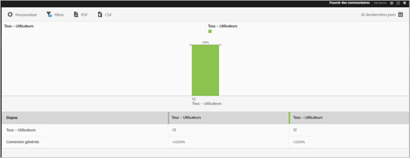

# Rapport Entonnoir{#funnel}

Le rapport **[!UICONTROL Entonnoir]** identifie le moment où les clients abandonnent une campagne marketing ou se détournent d’un chemin de conversion défini lors de l’interaction avec votre application mobile. Vous pouvez également utiliser le rapport **[!UICONTROL Entonnoir]** pour comparer les actions de différents segments.

L’obtention d’une bonne visibilité sur les décisions des clients à chaque étape vous permet de comprendre à quel moment ils ont été dissuadés, quel chemin ils ont tendance à emprunter, ainsi que le moment où les visiteurs quittent votre application.

Lorsque vous ouvrez le rapport **[!UICONTROL Entonnoir]**, vous devez créer un entonnoir personnalisé. Pour en savoir plus, voir [Personnalisation des rapports](/help/using/usage/reports-customize/reports-customize.md).

>[!TIP]
>
>Pour enregistrer votre entonnoir personnalisé, enregistrez l’URL après avoir configuré les paramètres et exécuté le rapport. Vous pouvez partager l’URL ou l’enregistrer dans un document.

Voici un exemple de rapport Versions :

Pour démontrer un entonnoir simple, voici les paramètres d’une configuration qui utilise trois étapes d’entonnoir et deux comparaisons d’entonnoir. Nous supposons qu’une application de démonstration permet aux utilisateurs d’ajouter un élément, tel qu’une photo, puis de le partager.

Dans la fenêtre Personnaliser, certaines sections indiquent que l’utilisateur a lancé l’application, a ajouté une photo à partir d’une galerie dans l’application, a partagé une ou plusieurs photos depuis l’application sur les médias sociaux, par SMS, par email, etc. Les comparaisons d’entonnoir permettent de comparer les niveaux d’ajout et de partage de photos entre les utilisateurs de l’application iOS et de l’application Android.

Pour générer le rapport, cliquez sur **[!UICONTROL Exécuter]**.

Voici un exemple de rapport généré :

La première série montre que 100 % des utilisateurs ont lancé l’application. La deuxième série montre qu’un pourcentage plus élevé d’utilisateurs d’Android ont ajouté une photo de la galerie. La troisième série montre que près de la moitié des utilisateurs d’iOS ont partagé la photo, mais qu’aucun des utilisateurs d’Android n’a partagé la photo. Cela peut indiquer un problème avec l’application qui doit être étudié.

Pour afficher des informations supplémentaires, placez le pointeur de la souris sur une barre du graphique.

Vous pouvez configurer les options suivantes pour ce rapport :

* **[!UICONTROL Période]**

   Cliquez sur l’icône **[!UICONTROL Calendrier]** pour sélectionner une période personnalisée ou prédéfinie dans la liste déroulante.
* **[!UICONTROL Personnaliser]**

   Personnalisez vos rapports en modifiant les options **[!UICONTROL Afficher par]**, en ajoutant des mesures et des filtres, en ajoutant des séries (mesures) supplémentaires, etc. Pour en savoir plus, voir [Personnalisation des rapports](/help/using/usage/reports-customize/reports-customize.md).
* **[!UICONTROL Filtrer]**

   Cliquez sur **[!UICONTROL Filtrer]** pour créer un filtre couvrant différents rapports, afin de visualiser le comportement d’un segment par rapport à l’ensemble des rapports mobiles. Un filtre d’attractivité vous permet de définir un filtre qui est appliqué à tous les rapports autres que de cheminement. Pour plus d’informations, voir [Ajout d’un filtre bascule](/help/using/usage/reports-customize/t-sticky-filter.md).
* **[!UICONTROL Télécharger]**

   Cliquez sur **[!UICONTROL PDF]** ou **[!UICONTROL CSV]** pour télécharger ou ouvrir les documents et les partager avec des utilisateurs qui n’ont pas accès à Mobile Services, ou pour utiliser le fichier dans des présentations.
