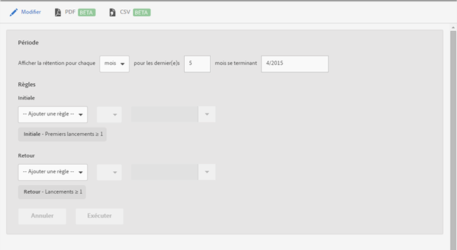

# Rapport de rétention {#retention}

{#eol}

Le rapport **[!UICONTROL Rétention]** (anciennement appelé Cohortes des premiers lancements) est un rapport de cohortes qui affiche le nombre d’utilisateurs uniques qui ont lancé votre application pour la première fois, puis l’ont lancée à nouveau au moins une fois au cours des mois suivants.

Par défaut, ce rapport montre la rétention de groupes d’utilisateurs en fonction du moment où les utilisateurs ont lancé l’application pour la première fois. Vous pouvez également personnaliser ce rapport pour utiliser une mesure autre que le premier lancement et ajouter d’autres actions.

Une cohorte est un groupe de personnes qui partagent une caractéristique ou une expérience commune au cours d’une période définie. Le rapport **[!UICONTROL Rétention]** répertorie la caractéristique commune des utilisateurs qui ont installé l’application un jour, une semaine ou un mois spécifique, puis crée un graphique comportant le nombre d’utilisateurs qui ont lancé l’application au cours des X jours, semaines ou mois suivants. Le rapport indique dans quelle mesure les visiteurs ont été retenus comme actifs ou engagés.

Voici un exemple de rapport Versions :

La colonne **[!UICONTROL M0]** indique le nombre total de personnes ayant lancé l’application pour la première fois en novembre 2014. La colonne **[!UICONTROL M1]** indique le nombre de personnes ayant lancé à nouveau l’application en décembre 2014, etc.

Cliquez sur **[!UICONTROL Modifier]** pour modifier la période ou les règles du rapport.

Le rapport peut contenir n’importe quelle variable ou mesure, y compris les mesures de cycle de vie (à l’exception toutefois des mesures calculées).
