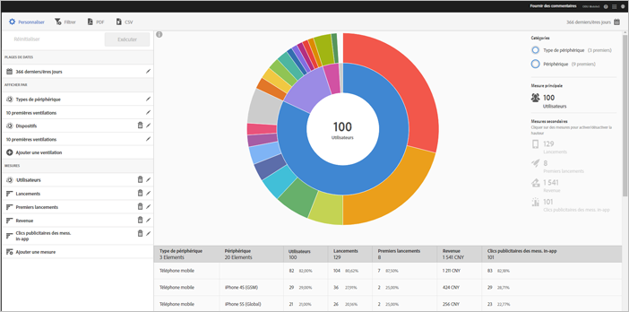

# Technology report {#technology}

Le rapport **[!UICONTROL Technologie]vous permet de visualiser les différents types d’appareils, systèmes d’exploitation, versions de système d’exploitation et opérateurs de téléphonie mobile sur lesquels votre application est utilisée.**

Ce rapport présente une visualisation radiale de vos données existantes, et vous permet de découvrir les segments d’audience (collections de visiteurs) pour le ciblage. La création et la gestion d’audiences sont semblables à la création et à l’utilisation de segments, excepté que vous pouvez rendre les audiences disponibles dans Experience Cloud.

## Navigation et utilisation {#section_83CA60E1AE6245FEBCBFF3205615C4DF}

Cette visualisation fournit par exemple le rapport de base et les ventilations, et utilise la hauteur pour montrer la mesure concernée et les différences de performances entre les mesures. Chaque anneau représente un segment d’audience dans la catégorie de l’anneau. Vous pouvez exécuter des actions sur une audience, comme appliquer un filtre d’attractivité et afficher ou masquer des mesures.

>[!TIP]
>
>Outre ces informations, vous pouvez consulter un didacticiel produit qui décrit comment interagir avec le graphique radial. To start the tutorial, click **[!UICONTROL Technology Breakdown]** in the title bar of the report, click **[!UICONTROL Customize]**, and click the **[!UICONTROL i]** icon.

Le graphique radial est interactif et vous permet d’effectuer les tâches suivantes :

* Survolez une partie quelconque du graphique avec la souris pour afficher plus d’informations.
* Modifiez la période en cliquant sur l’icône **[!UICONTROL Calendrier].**
* Cliquez sur une tranche de l’anneau pour sélectionner l’audience pour laquelle vous pouvez exécuter certaines actions, notamment zoomer, masquer les audiences et créer un message in-app ou un filtre bascule.
* Dans l’angle supérieur droit, sélectionnez **[!UICONTROL Type d’appareil]** et **Appareil]pour afficher des informations sur les appareils et les types d’appareils.[!UICONTROL **

* Cliquez sur une mesure secondaire sur le côté droit pour l’ajouter à la visualisation.

   Vous pouvez afficher la mesure secondaire en spécifiant la couleur, la hauteur ou les deux.

Le tableau suivant décrit les rapports standards et la manière dont ils sont alimentés dans Adobe Mobile Services :

| Rapport | Méthode de remplissage | Description |
|--- |--- |--- |
| Device   | Mesures de cycle de vie | Mesures courantes ventilées par type de périphérique. |
| Systèmes d’exploitation | Automatique | Mesures courantes ventilées par système d’exploitation. |
| Version du système d’exploitation | Mesures de cycle de vie | Mesures courantes ventilées par version du système d’exploitation. |
| Opérateurs | Automatique | Mesures courantes ventilées par opérateur. |

>[!TIP]
>
>In the Carriers report, Wi-fi users are reported as .****`none`

## Ajout de ventilations et de mesures {#section_15833511E82648869E7B1EFC24EF7B82}

Vous pouvez ajouter des ventilations et des mesures secondaires qui modifient la hauteur de chaque audience par rapport aux autres audiences du graphique.

>[!IMPORTANT]
>
>Plus vous ajoutez d'anneaux au soleil, plus le processus prend de temps.

Pour ajouter des ventilations et des mesures secondaires, cliquez sur **[!UICONTROL Ventilation technologique]** dans la barre de titres du rapport, puis sur **[!UICONTROL Personnaliser]**.

When you click **[!UICONTROL Add Breakdown]** or **[!UICONTROL Add Metric]**, a new item displays with the same name as the previous item in the list. Cliquez sur la ventilation ou la mesure nouvellement créée pour accéder à une liste déroulante à partir de laquelle sélectionner un nouvel élément.

## Création d’un filtre d’attractivité {#section_B4E355CD1FE34E4C8ADC38139ED67FC8}

Cliquez sur une tranche de l’anneau pour sélectionner l’audience pour laquelle vous souhaitez créer un filtre d’attractivité, puis cliquez sur **[!UICONTROL Filtre bascule]**. Ce filtre permet d’appliquer les filtres actuels et d’exécuter un nouveau rapport selon les filtres.

## Partage de rapports {#section_560DD5CED5144249B7E49461E2422100}

Une fois un rapport créé, vos paramètres sont utilisés pour créer une URL personnalisée que vous pouvez copier et partager.
