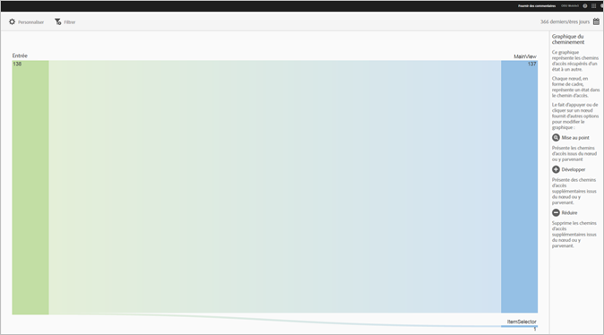
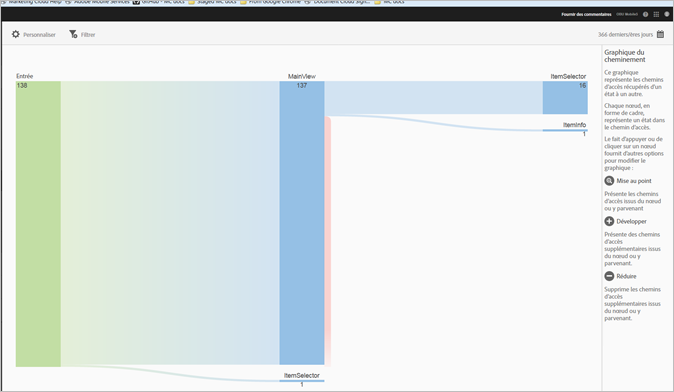
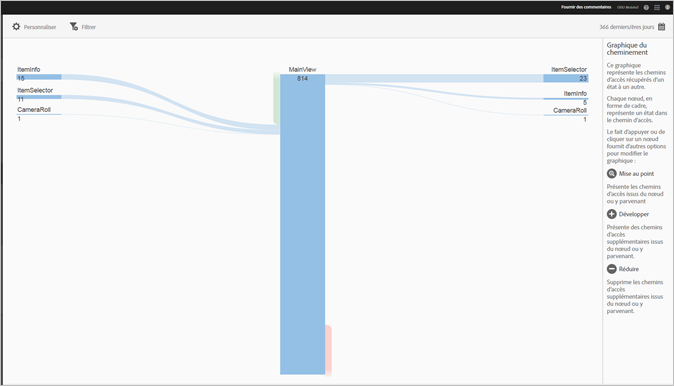
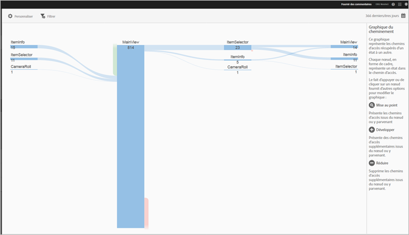

# Afficher le rapport Chemins d’accès {#view-paths}

{#eol}

Le rapport **[!UICONTROL Chemins d’accès des vues]** est basé sur l’analyse des chemins d’accès et affiche un graphique des chemins représentant les voies empruntées entre deux états de l’application.

>[!TIP]
>
>Les rapports **[!UICONTROL Chemins d’accès des vues]** et **[!UICONTROL Chemins d’accès des actions]** sont très similaires, car il s’agit dans les deux cas de rapports de cheminement. Le rapport **[!UICONTROL Chemins d’accès des vues]** vous permet de visualiser la manière dont les utilisateurs naviguent d’un écran à l’autre au sein de votre application. Le rapport **[!UICONTROL Chemins d’accès des actions]** montre la séquence des actions (événements tels que des clics, sélections, redimensionnements, etc.) accomplies par les utilisateurs dans votre application. Vous pouvez utiliser un rapport Entonnoir pour combiner la navigation et les actions dans un rapport. Pour plus d’informations, reportez-vous à la section [Entonnoir](/help/using/usage/reports-funnel.md).

Chaque nœud a la forme d’une boîte et représente un état dans les chemins d’accès des utilisateurs par le biais d’une application. Par exemple, dans l’illustration ci-dessus, le nœud supérieur représente le nombre d’utilisateurs qui ont lancé l’application et qui ont accédé à la vue principale.

Lorsque vous cliquez sur un nœud pour afficher les options supplémentaires de modification du graphique, des options telles que **[!UICONTROL Mise au point]** ou **[!UICONTROL Développer]** apparaissent. Si, par exemple, vous cliquez sur l’état **[!UICONTROL MainView]** dans le nœud supérieur, les icônes **[!UICONTROL Mise au point]** et **[!UICONTROL Développer]** s’affichent.

Pour agrandir l’affichage, cliquez sur l’icône **[!UICONTROL +]** de sorte à afficher les autres chemins d’accès au départ ou à destination du nœud. Dans l’illustration ci-dessous, l’état 1 lance l’application, l’état 2 affiche la page principale de l’application et l’état 3 inclut les chemins suivants empruntés par les utilisateurs :

* Navigation vers la pellicule
* navigation vers le sélecteur d’éléments
* navigation vers la caméra
* navigation vers la page d’informations sur l’élément

Cliquez sur  pour isoler le nœud et afficher les chemins d’accès entrants et sortants du nœud sélectionné. Dans l’illustration ci-dessous, les chemins suivants ont précédé les utilisateurs qui consultaient la vue principale de l’application :

* informations sur l’élément
* sélecteur d’éléments
* Pellicule
* Caméra

Vous pouvez cibler ou développer plusieurs nœuds afin d’obtenir une vue détaillée des chemins empruntés par les utilisateurs dans votre application. Par exemple :

Vous pouvez configurer les options suivantes pour ce rapport :

* **[!UICONTROL Période]**
Cliquez sur l’icône **[!UICONTROL Calendrier]** pour sélectionner une période personnalisée ou prédéfinie dans la liste déroulante
* **[!UICONTROL Personnaliser]**
Personnalisez vos rapports en modifiant les options **[!UICONTROL Afficher par]**, en ajoutant des mesures et des filtres, en ajoutant des séries (mesures) etc. Pour en savoir plus, voir [Personnalisation des rapports](/help/using/usage/reports-customize/reports-customize.md).
* **[!UICONTROL Filtre]**
Cliquez sur **[!UICONTROL Filtre]** pour créer un filtre couvrant différents rapports, afin de visualiser le comportement d’un segment par rapport à l’ensemble des rapports mobiles. Un filtre d’attractivité vous permet de définir un filtre qui est appliqué à tous les rapports autres que de cheminement. Pour plus d’informations, voir [Ajout d’un filtre bascule](/help/using/usage/reports-customize/t-sticky-filter.md).
* **[!UICONTROL Téléchargement]**
Cliquez sur **[!UICONTROL PDF]** ou **[!UICONTROL CSV]** pour télécharger ou ouvrir les documents et les partager avec des utilisateurs qui n’ont pas accès à Mobile Services, ou pour utiliser le fichier dans des présentations.
