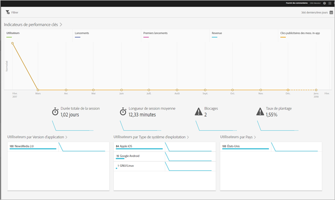

# Rapport Aperçu {#overview}

Le rapport Aperçu fournit un aperçu de vos mesures clés.

Voici un exemple de rapport Versions :

Vous pouvez modifier la période du rapport en cliquant sur l’icône Calendrier dans la partie supérieure droite. Vous pouvez aussi créer un filtre bascule couvrant différents rapports, afin de visualiser le comportement d’un segment par rapport à l’ensemble des rapports mobiles. Pour plus d’informations sur la création d’un filtre bascule, voir [Ajout d’un filtre bascule](/help/using/usage/reports-customize/t-sticky-filter.md).

>[!TIP]
>
>La configuration des mesures clés du rapport s’effectue lors de la création de l’application. Pour plus d’informations, voir [Configuration de votre application](/help/using/c-manage-app-settings/c-mob-confg-app/c-mob-confg-app.md).
