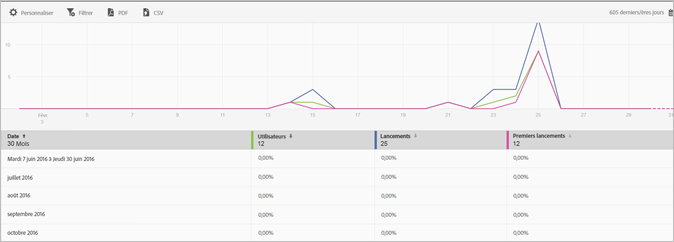

# Rapport Utilisateurs et sessions{#users-and-sessions}

Le rapport Utilisateurs et sessions affiche les mesures relatives aux visiteurs uniques pendant la période sélectionnée.

Vous pouvez configurer les options suivantes pour ce rapport :

* **[!UICONTROL Période]**

   Cliquez sur l’icône **[!UICONTROL Calendrier]** pour sélectionner une période personnalisée ou prédéfinie dans la liste déroulante.

* **[!UICONTROL Personnaliser]**

   Personnalisez vos rapports en modifiant les options **[!UICONTROL Afficher par]**, en ajoutant des mesures et des filtres, en ajoutant des séries (mesures) supplémentaires, etc. Pour en savoir plus, voir [Personnalisation des rapports](/help/using/usage/reports-customize/t-reports-customize.md).

* **[!UICONTROL Filtrer]**

   Cliquez sur **[!UICONTROL Filtrer]** pour créer un filtre couvrant différents rapports, afin de visualiser le comportement d’un segment par rapport à l’ensemble des rapports mobiles. Un filtre d’attractivité vous permet de définir un filtre qui est appliqué à tous les rapports autres que de cheminement. Pour plus d’informations, voir [Ajout d’un filtre bascule](/help/using/usage/reports-customize/t-sticky-filter.md).

* **[!UICONTROL Télécharger]**

   Cliquez sur **[!UICONTROL PDF]** ou **[!UICONTROL CSV]** pour télécharger ou ouvrir les documents et les partager avec des utilisateurs qui n’ont pas accès à Mobile Services, ou pour utiliser le fichier dans des présentations.