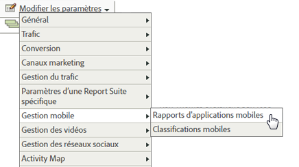

# Analytics {#analytics}

Après avoir ajouté la bibliothèque à votre projet, vous pouvez effectuer n’importe quel appel de méthode Analytics n’importe où dans votre application.

>[!TIP]
>
>Veillez à importer `ADBMobile.h` dans votre classe.

## Activation des rapports sur les applications mobiles dans Analytics {#section_F2F9234009184F20BA36B5CDE872B424}

Avant d’ajouter du code, demandez à votre administrateur Analytics de procéder comme suit pour activer le suivi du cycle de vie des applications mobiles. Ainsi, votre suite de rapports est prête à capturer les mesures au fur et à mesure que vous commencez le développement.

1. Ouvrez **[!UICONTROL Outils d’administration]** > **[!UICONTROL Suites de rapports]** et sélectionnez votre ou vos suites de rapports mobiles.
1. Cliquez sur **[!UICONTROL Modifier les paramètres]** > **[!UICONTROL Gestion mobile]** > **[!UICONTROL Rapports d’applications mobiles]**.

   

1. Cliquez sur **[!UICONTROL Activer les derniers rapports d’application]**.

   Vous pouvez également cliquer sur **[!UICONTROL Activer le suivi de l’emplacement mobile]** et **[!UICONTROL Activer les rapports et attribution hérités pour les accès en arrière-plan]**.

   

Les mesures de cycle de vie sont maintenant prêtes à être capturées et les rapports d’applications mobiles apparaissent dans le menu **[!UICONTROL Rapports]** de l’interface des rapports marketing.

### Nouvelles versions

Régulièrement, de nouvelles versions des rapports d’applications mobiles sont publiées. Les nouvelles versions ne sont pas automatiquement appliquées à votre suite de rapports. Vous devez répéter ces étapes pour effectuer la mise à niveau. Chaque fois que vous ajoutez une nouvelle fonctionnalité d’Experience Cloud à votre application, nous vous recommandons de répéter ces étapes pour vous assurer que vous disposez de la configuration la plus récente.

## Mesures de cycle de vie {#section_532702562A7A43809407C9A2CBA80E1E}

Pour collecter les mesures de cycle de vie dans votre application, ajoutez des appels à lorsque l’application est activée, comme illustré dans les exemples suivants.

### WinJS dans default.js

```js
app.onactivated = function (args) { 
  if (args.detail.kind === activation.ActivationKind.launch) { 
   ... 
   // launched and resumed stuff  
   ADBMobile.Config.collectLifecycleData(); 
  } 
}; 
app.oncheckpoint = function (args) { 
  ADBMobile.Config.pauseCollectingLifecycleData(); 
}
```

### C# dans App.xaml.cs

```js
public App() 
{ 
    this.InitializeComponent(); 
    this.Resuming *= OnResuming; 
    this.Suspending *= OnSuspending; 
} 
protected override void OnLaunched(LaunchActivatedEventArgs e) 
{ 
    ... 
    ADBMobile.Config.CollectLifecycleData(); 
    ... 
} 
private void OnResuming(object sender, object e) 
{ 
    ... 
    ADBMobile.Config.CollectLifecycleData(); 
    ... 
} 
private void OnSuspending(object sender, SuspendingEventArgs e) 
{ 
    ... 
    ADBMobile.Config.PauseCollectingLifecycleData(); 
    ... 
}
```

### C/CX dans App.xaml.cpp

```js
App::App() 
{ 
 InitializeComponent(); 
 Resuming *= ref new EventHandler<Object ^>(this, &App::OnResuming); 
 Suspending *= ref new SuspendingEventHandler(this, &App::OnSuspending); 
} 
void App::OnResuming(Object ^sender, Object ^args) 
{ 
 ... 
 ADBMobile::Config::CollectLifecycleData(); 
 ... 
} 
void App::OnSuspending(Object^ sender, SuspendingEventArgs^ e) 
{ 
 ... 
 ADBMobile::Config::PauseCollectingLifecycleData(); 
 ... 
} 
void App::OnLaunched(Windows::ApplicationModel::Activation::LaunchActivatedEventArgs^ e) 
{ 
 ... 
 ADBMobile::Config::CollectLifecycleData(); 
 ... 
}
```

Si `CollectLifecycleData()` est appelé deux fois au cours de la même session, votre application signale un plantage à chaque appel après le premier. Le SDK définit un indicateur lorsque l’application est arrêtée, indiquant une fermeture réussie. Si cet indicateur n’est pas défini, `CollectLifecyleData()` signale un plantage.

## Événements, props et eVars {#section_76EA6F5611184C5CAE6E62956D84D7B6}

Si vous avez consulté la [référence sur les classes et méthodes ADBMobile](/help/windows-appstore/c-configuration/methods.md), vous vous demandez probablement où définir des événements, des eVars, des props, des héritiers et des listes. Dans la version 4, vous ne pouvez plus affecter ces types de variables directement dans votre application. Au lieu de cela, le SDK utilise des données contextuelles et des règles de traitement pour mapper les données de votre application sur les variables Analytics à des fins de reporting.

Les règles de traitement présentent plusieurs avantages :

* Vous pouvez modifier le mapping de vos données sans envoyer de mise à jour à la boutique d’applications.
* Vous pouvez utiliser des noms significatifs pour les données au lieu de définir des variables spécifiques à une suite de rapports.
* L’envoi de données supplémentaires n’a que peu d’impact. Ces valeurs n’apparaîtront dans les rapports qu’après avoir été mappées à l’aide de règles de traitement.

Toutes les valeurs que vous assignez directement aux variables doivent être ajoutées aux données contextuelles à la place.

## Règles de traitement {#section_66EE762EEA5E4728864166201617DEBF}

Les règles de traitement sont utilisées pour copier les données que vous envoyez dans des variables de données contextuelles vers des eVars, des props et d’autres variables pour la création de rapports.

[Formation aux règles de traitement](https://tv.adobe.com/embed/1181/16506/) @ Summit 2013

[Présentation des règles de traitement](https://experienceleague.adobe.com/docs/analytics/admin/admin-tools/processing-rules/processing-rules.html)

Nous vous recommandons de regrouper vos variables de données contextuelles à l’aide d’&quot;espaces de noms&quot;, car cela vous aide à conserver un ordre logique. Par exemple, si vous souhaitez collecter des informations sur un produit, vous pouvez définir les variables suivantes :

```js
"product.type":"hat" 
"product.team":"mariners" 
"product.color":"blue"
```

Les variables de données contextuelles sont triées par ordre alphabétique dans l’interface des règles de traitement. Les espaces de noms vous permettent donc de voir rapidement les variables qui se trouvent dans le même espace de noms.

En outre, nous avons entendu dire que certains d’entre vous nomment des clés de données contextuelles à l’aide de l’eVar ou du numéro de prop :

```js
"eVar1":"jimbo"
```

Cela peut rendre *légèrement* plus facile lorsque vous effectuez le mappage unique dans les règles de traitement, mais vous perdez la lisibilité pendant le débogage et les futures mises à jour du code peuvent être plus difficiles. Nous vous recommandons plutôt d’utiliser des noms explicites pour les clés et les valeurs :

```js
"username":"jimbo"
```

Définissez les variables contextuelles qui définissent les événements de compteur sur une valeur de &quot;1&quot; :

```js
"logon":"1"
```

Les variables de données contextuelles qui définissent les événements d’incrémentation peuvent avoir la valeur à incrémenter :

```js
"levels completed":"6"
```

>[!NOTE]
>
>Adobe réserve l’espace de noms « `a.` ». Outre cette petite restriction, les variables de données contextuelles doivent simplement être uniques dans votre société de connexion pour éviter les collisions.

## Variable products {#section_AFBA36F3718C44D29AF81B9E1056A1B4}

Pour définir *`products`* dans le SDK mobile, vous devez utiliser une syntaxe spéciale. Voir [Variable products](/help/windows-appstore/analytics/products/products.md).

## (Facultatif) Activation du suivi hors ligne {#section_955B2A03EB854742BDFC4A0A3C287009}

Pour stocker les accès lorsque l’appareil est hors ligne, vous pouvez activer le suivi hors ligne dans la [configuration ADBMobileConfig.json](/help/windows-appstore/c-configuration/methods.md). Avant d’activer le suivi hors ligne, prêtez attention aux exigences d’horodatage décrites dans la référence du fichier de configuration.

## Géolocalisation et points ciblés {#section_BAD34A8DD013454DB355121316BD7FD4}

La géolocalisation vous permet de mesurer les données de position (latitude/longitude) et les points ciblés prédéfinis. Chaque appel `TrackLocation` envoie :

* Latitude/longitude et point ciblé (si dans un point ciblé défini dans le fichier de configuration `ADBMobileConfig.json`). Elles sont transmises aux variables de solution mobile pour la création de rapports automatique.
* Distance par rapport au centre et précision transmises en tant que données contextuelles. Capturer à l’aide d’une règle de traitement.

Pour effectuer le suivi d’un emplacement :

```js
var ADB = ADBMobile; 
ADB.Analytics.trackLocation(37.75345, -122.33207, null);
```

Si le point ciblé suivant est défini dans le fichier de configuration `ADBMobileConfig.json` :

```js
"poi" : [ 
            ["San Francisco",37.757144,-122.44812,7000], 
        ]
```

Lorsque l’emplacement de l’appareil est déterminé dans un rayon de 7 000 mètres à partir du point défini, une variable de données contextuelles `a.loc.poi` avec la valeur &quot;San Francisco&quot; est envoyée avec l’accès `TrackLocation`. Une variable contextuelle `a.loc.dist` est envoyée avec la distance en mètres depuis les coordonnées définies.

## Valeur de durée de vie {#section_D2C6971545BA4D639FBE07F13EF08895}

La valeur de durée de vie vous permet de mesurer et de cibler une valeur de durée de vie pour chaque utilisateur. À chaque fois que vous envoyez une valeur avec `TrackLifetimeValueIncrease`, la valeur est ajoutée à la valeur existante. La valeur de durée de vie est stockée sur l’appareil et peut être récupérée à tout moment en appelant `GetLifetimeValue`. Cette procédure peut être utilisée pour stocker des valeurs de durée de vie (achats, vues des publicités, affichages complets de vidéos, partages sur les médias sociaux, chargement de photos, etc.).

```js
// Lifetime Value Example 
var ADB = ADBMobile; 
var purchasePrice = 39.95; 
var cdata = new Windows.Foundation.Collections.PropertySet(); 
cdata["ItemPurchaseEvent"] = "ItemPurchaseEvent"; 
cdata["PurchaseItem"] = "Item453"; 
cdata["PurchasePrice"] = purchasePrice; 
ADB.Analytics.trackLifetimeValueIncrease(purchasePrice, cdata);
```

## Actions minutées {#section_7FF8B6A913A0460EAA4CAE835E32D8C1}

Les actions minutées vous permettent de mesurer la durée in-app et la durée totale entre le début et la fin d’une action. Le SDK calcule la durée de la session et la durée totale (intersessions) nécessaire à l’exécution de l’action. Vous pouvez l’utiliser pour définir des segments à comparer au moment de l’achat, au niveau de transmission, au flux de passage en caisse, etc.

* Nombre total de secondes dans l’application entre le début et la fin (intersessions)
* Nombre total de secondes entre le début et la fin (heure de l’horloge)

```js
// Timed Action Start Example 
var ADB = ADBMobile; 
var cdata = new Windows.Foundation.Collections.PropertySet(); 
cdata["ExperienceName"] = experience; 
ADB.Analytics.trackTimedActionStart("TimeUntilPurchase", cdata);
```

```js
// Timed Action Update Example 
var ADB = ADBMobile; 
var cdataUpdate = new Windows.Foundation.Collections.PropertySet(); 
cdataUpdate["ImageLiked"] = imageName; 
ADB.Analytics.trackTimedActionStart("TimeUntilPurchase", cdata); 
```

```js
// Timed Action End Example 
var ADB = ADBMobile; 
ADB.Analytics.trackTimedActionEnd("TimeUntilPurchase");
```
