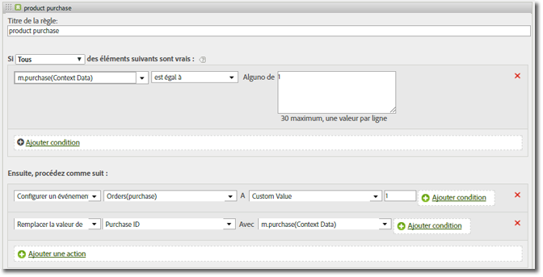

# Products variable{#products-variable}

La variable products ne peut pas être définie à l’aide des règles de traitement. Dans le SDK Mobile, vous devez utiliser une syntaxe spéciale dans le paramètre de données contextuelles pour définir la variable products directement sur l’appel de serveur.

To set the *`products`* variable, set a context data key to `"&&products"`, and set the value using the syntax defined for the *`products`*:

```js
cdata["&&products"] = "Category;Product;Quantity;Price[,Category;Product;Quantity;Price]";
```

Par exemple :

```js
//create a context data dictionary 
var cdata = new Windows.Foundation.Collections.PropertySet(); 
 
// add products, a purchase id, a purchase context data key, and any other data you want to collect. 
// Note the special syntax for products 
cdata["&&products"] = ";Running Shoes;1;69.95,;Running Socks;10;29.99"; 
cdata["m.purchaseid"] = "1234567890"; 
cdata["m.purchase"] = "1"; 
 
var ADB = ADBMobile; 
// send the tracking call - use either a trackAction or TrackState call. 
// trackAction example: 
ADB.Analytics.trackAction("purchase", cdata); 
// trackState example: 
ADB.Analytics.trackState("Order Confirmation", cdata);
```

*`products`* is set directly on the image request, and the other variables are set as context data. Toutes les variables de données contextuelles doivent être mises en correspondance à l’aide des règles de traitement :



You do not need to map the *`products`* variable using processing rules since it is set directly on the image request by the SDK.
