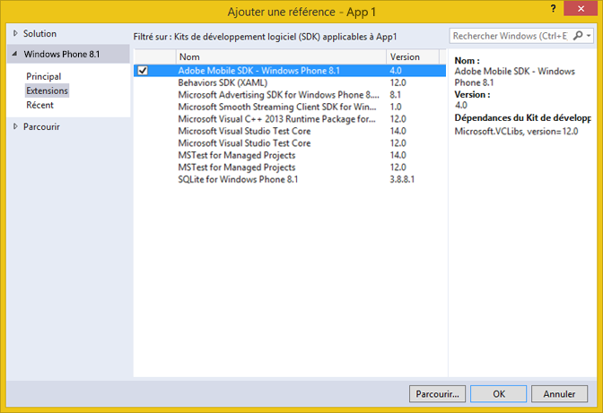

# Extensions de Windows Visual Studio pour le SDK 4.x des solutions Experience Cloud {#windows-visual-studio-extensions-for-experience-cloud-solutions-x-sdk}

Ces extensions vous offrent un moyen beaucoup plus facile d&#39;ajouter la référence du SDK Windows 4.x de solutions Experience Cloud dans votre projet.

## Installer la bibliothèque à partir de GitHub {#section_F55DB6241EF1475286C05FEAEBF996A3}

1. Téléchargez le SDK Windows Universal à partir de [GitHub](https://github.com/Adobe-Marketing-Cloud/mobile-services/releases).
1. Décompressez le fichier téléchargé localement.
1. Doublon-cliquez sur le fichier ADBMobileWindowsStoreVSIX.vsix ou ADBMobileWindowsPhoneVSIX.vsix pour ouvrir le programme d’installation.

1. Sélectionnez **[!UICONTROL Emplacement global]** et installez la bibliothèque.

## Références Ajoutées à votre projet {#section_00C14FE9243D4330BE1F4BB56FCF08B1}

1. Ouvrez votre projet Windows 8.1 ou Windows Phone 8.1.
1. Ouvrez la boîte de dialogue Gestionnaire de références.

   

1. Dans l&#39;onglet **[!UICONTROL Extensions]** de Windows 8.1 ou Windows Phone 8.1, recherchez et sélectionnez **[!UICONTROL Adobe Mobile SDK]**.
1. Cliquez sur **[!UICONTROL OK]** pour l’enregistrer.

   L&#39;Adobe Mobile SDK sera ajouté à votre projet et, s&#39;il n&#39;a pas déjà été ajouté, le package **[!UICONTROL Microsoft Visual C++ Runtime]** est également ajouté.

1. Dans Configuration Manager, sélectionnez un type de plate-forme et commencez à tester votre application.
