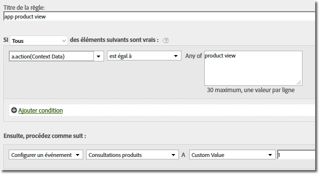

# Migration vers les SDK 4. x {#migrate-to-the-x-sdks}

Cette section décrit comment migrer de la version 3.x d’un SDK Windows Mobile précédent vers la version 4.x du SDK Boutique d’applications Windows 8.1 universelle pour les solutions Experience Cloud.

Avec la mise à niveau vers la version 4.x, toutes les fonctionnalités sont désormais accessibles par l’intermédiaire de méthodes statiques. Il n’est donc plus nécessaire d’effectuer le suivi de vos propres objets.

Les sections suivantes vous expliquent comment migrer de la version 3.x vers la version 4.x.

## Remove unused properties {#section_145222EAA20F4CC2977DD883FDDBBFC5}

Vous avez probablement remarqué un nouveau fichier `ADBMobileConfig.json` inclus avec votre téléchargement. Ce fichier contient des paramètres globaux spécifiques à l'application et remplace la plupart des variables de configuration qui ont été utilisées dans les versions précédentes. Voici un exemple de fichier `ADBMobileConfig.json` :

```js
{ 
    "version" : "1.0", 
    "analytics" : { 
        "rsids" : "coolApp", 
        "server" : "my.CoolApp.com", 
        "charset" : "UTF-8", 
        "ssl" : true, 
        "offlineEnabled" : true, 
        "lifecycleTimeout" : 300, 
        "privacyDefault" : "optedin", 
        "poi" : [ 
                    ["san francisco",37.757144,-122.44812,7000], 
                    ["santa cruz",36.972935,-122.01725,600] 
                ] 
    }, 
 "target" : { 
  "clientCode" : "myTargetClientCode", 
  "timeout" : 5 
 }, 
 "audienceManager" : { 
  "server" : "myServer.demdex.com" 
 } 
}
```

Le tableau suivant répertorie les variables de configuration que vous devez déplacer vers le fichier de configuration. Déplacez la valeur définie pour la variable de la première colonne vers la variable de la deuxième colonne, puis supprimez l’ancienne variable de configuration de votre code.

## Migration à partir de 3. x

| Variable/méthode de configuration | Variable in the `ADBMobileConfig.json` file. |
|--- |--- |
| offlineTrackingEnabled | "offlineEnabled" |
| reportSuiteIDs | "rsids" |
| trackingServer | "server" |
| charSet | "charset" |
| currencyCode | "currency" |
| ssl | "ssl" |
| setOfflineHitLimit | Supprimée, n’est plus utilisée. |
| linkTrackVars | Supprimée, n’est plus utilisée. |
| linkTrackEvents | Supprimée, n’est plus utilisée. |

## Update track calls and tracking variables {#section_96E7D9B3CDAC444789503B7E7F139AB9}

Au lieu d’utiliser les appels `Track` et `TrackLink` axés sur le web, la version 4 du SDK utilise deux méthodes qui sont plus logiques dans l’environnement mobile :

* `TrackState` Les états correspondent aux affichages disponibles dans l’application : tableau de bord d’accueil, paramètres d’application, panier, etc. Ces états sont semblables aux pages d’un site web ; les appels `trackState` incrémentent les pages vues.

* `TrackAction` Les actions sont les événements qui se produisent dans l’application et que vous souhaitez mesurer, par exemple les connexions, les appuis sur la bannière, les abonnements aux flux, etc. Ces appels n’incrémentent pas les pages vues.

Le paramètre `contextData` pour ces deux méthodes comporte les paires nom-valeur envoyées en tant que données contextuelles.

## Événements, props et eVars

Si vous avez consulté les [méthodes du SDK](/help/windows-appstore/c-configuration/methods.md), vous vous demandez probablement où définir les événements, evars, props, heirs et listes. Dans la version 4, vous ne pouvez plus affecter ces types de variables directement dans l’application. À la place, le SDK utilise des données contextuelles et des règles de traitement afin de faire correspondre les données de l’application aux variables Analytics à des fins de création de rapports.

Les règles de traitement présentent plusieurs avantages :

* Vous pouvez modifier la correspondance des données sans soumettre de mise à jour dans la boutique d’applications.
* Vous pouvez utiliser des noms significatifs pour les données au lieu de définir des variables spécifiques à une suite de rapports.
* L’envoi de données supplémentaires a très peu d’impact. Ces valeurs n’apparaîtront pas dans les rapports tant qu’elles ne sont pas mappées à l’aide des règles de traitement.

For more information, see *Processing Rules* in [Analytics](/help/windows-appstore/analytics/analytics.md).

Les valeurs que vous avez affectées directement aux variables doivent plutôt être ajoutées aux données contextuelles. This means that calls to `SetProp`, `SetEvar`, and assignments to persistent context data should all be removed and the values added to context data.

**AppSection/Server, GeoZip, Transaction ID, Campaign et autres variables standard**

Toutes les autres données que vous configuriez sur l’objet de mesure, y compris les variables répertoriées ci-dessus, doivent être ajoutées à la place aux données contextuelles.

Autrement dit, les seules données envoyées avec un appel `TrackState` ou `TrackAction` sont les données utiles du paramètre `data`.

### Remplacement des appels de suivi

Dans votre code, remplacez les méthodes suivantes par un appel à `trackState` ou à `trackAction` :

### Migration à partir de 3. x

* `TrackAppState` (TrackState)
* `TrackEvents` (TrackAction)
* `Track` (TrackAction)
* `TrackLinkURL` (TrackAction)

## Custom visitor ID {#section_2CF930C13BA64F04959846E578B608F3}

Replace the `visitorID` variable with a call to `setUserIdentifier`.

## Offline tracking {#section_5D4CD8CD1BE041A79A8657E31C0D24C6}

Le suivi hors ligne est activé dans `ADBMobileConfig.json` le fichier. Toute autre configuration hors ligne est effectuée automatiquement.

Dans votre code, supprimez les appels aux méthodes suivantes :

### Migration à partir de 3. x

* `SetOnline`
* `SetOffline`

## Products variable {#section_AFBA36F3718C44D29AF81B9E1056A1B4}

Puisque la variable `products` n’est plus disponible dans les règles de traitement, vous pouvez utiliser la syntaxe suivante pour la définir :

```js
// create a processing rule to set the corresponding product event. 
// for example, set the Product Views event when context data a.action = "product view" 
var cdata = new Windows.Foundation.Collections.PropertySet(); 
cdata["&&products"] = ";Cool Shoe"; 
ADB.Analytics.trackAction("product view", cdata);
```



In this example, the value of `"&&products"` is `";Cool Shoe`" and should follow the products string syntax for the type of event that you are tracking.